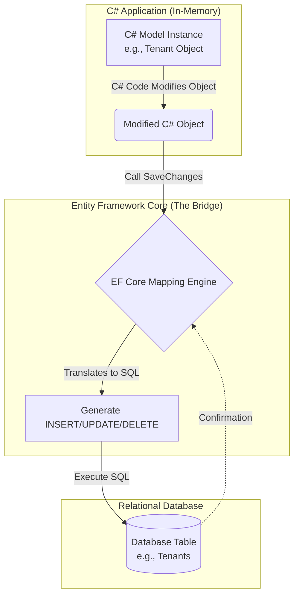

# Module 1: Introduction to Entity Framework Core

Welcome to **EF Core Fundamentals**. Throughout this course, we will build **Normora**—a real-world, multi-tenant SaaS application. We'll explore how EF Core manages data for complex domains like `Tenant`, `User`, and `TenantBranding`.

---

## 1. How an ORM Bridges the Gap

An **Object-Relational Mapper (ORM)** is the bridge between the object-oriented world of C# and the relational world of SQL databases. To understand how it works, let's break down the two sides of our application:

### The C# (In-Memory) Side
*   **Models Define the Shape:** In C#, we create classes (Models) that define exactly what our data looks like (e.g., a `Tenant` class with `Id`, `Name`, and `Domain` properties). 
*   **Rows Match Models:** Every row in a database table corresponds directly to an instance of these C# models.
*   **In-Memory Updates:** When we want to modify data, we simply use standard C# functions to update properties on these objects. At this stage, all changes are purely **in-memory**.

### The Database Side
*   **Persisting Changes:** To ensure the data we modified in C# isn't lost when the application stops, we must send it to a persistent Database.
*   **SQL Statements:** Relational databases don't understand C# objects; they only understand SQL commands (`INSERT`, `UPDATE`, `DELETE`). 

### The Role of EF Core
This is where Entity Framework Core steps in. Ultimately, **DATA** is the payload that travels back and forth between your C# code and the database, and the ORM acts as the specialized vehicle transporting it. 

As an ORM, EF Core creates the **mapping** between your C# models and the database tables. This mapping is the engine that drives the ORM's functionality. 

Once a connection is established, you can call built-in EF Core functions to manipulate data. Because EF Core is **strongly typed**, you use **LINQ (Language Integrated Query)** to query and build your operations. The ORM automatically translates your C# LINQ queries and in-memory changes into the exact SQL statements needed, and executes them against the database. You stay entirely within C#!

### The Data Flow



### Real-World Scenario: Loading a Tenant
Without an ORM, you might write:
```csharp
var tenant = new Tenant();
using (var connection = new SqlConnection(connectionString)) 
{
    var command = new SqlCommand("SELECT Id, Name, Domain FROM Tenants WHERE Id = @Id", connection);
    command.Parameters.AddWithValue("@Id", tenantId);
    connection.Open();
    using (var reader = command.ExecuteReader()) 
    {
        if (reader.Read()) 
        {
            tenant.Id = reader.GetGuid(0);
            tenant.Name = reader.GetString(1);
            tenant.Domain = reader.GetString(2);
        }
    }
}
```

With **EF Core**, this is reduced to one highly readable line of code:
```csharp
var tenant = _dbContext.Tenants.FirstOrDefault(t => t.Id == tenantId);
```

### The Cost of Not Using an ORM (Raw SQL Pitfalls)
If we do not use an ORM, we are forced to use raw string literals to perform queries and updates from our code (like the `SELECT` string above). This approach introduces several major risks:
1. **Error Prone:** A simple typo in the SQL string literal won't be caught by the C# compiler. It will only fail at runtime.
2. **Maintenance Nightmare:** If the `Tenant` model changes—for instance, if we rename a property or add a column—we would have to hunt down and manually update every single SQL string literal across the entire application that references it. This is tedious and highly susceptible to bugs.
3. **Incomplete Updates:** When manually writing raw `UPDATE` strings, there is a high risk of simply forgetting to include a newly added column, resulting in data loss or inconsistencies.
4. **Security Risks (SQL Injection):** Concatenating raw SQL strings can easily open your application up to SQL Injection attacks. **EF Core automatically uses parameterized queries** under the hood, neutralizing this security risk out of the box.

*Best Practice (Compile-Time Safety & Refactoring):* One of the biggest advantages of EF Core is **compile-time safety**. Because your queries are written in C# using strongly-typed models and **LINQ**, it makes **refactoring significantly easier**. If your data model's shape changes (e.g., you rename a property), your IDE can automatically update all LINQ references. If a reference is missed, it results in an immediate **compile-time error**. You catch mistakes instantly during the build process, rather than waiting for a production crash. This drastically reduces bugs and allows you to focus on business logic.

---

## 2. EF Core vs. The World

You might wonder why Normora chose **EF Core** instead of alternatives like Dapper or pure ADO.NET.

*   **ADO.NET:** The foundational data access technology in .NET. It is extremely fast but requires writing a lot of boilerplate code (as seen above).
*   **Dapper:** A popular "micro-ORM". It maps SQL results to C# objects automatically but still requires you to write the raw SQL queries (e.g., `connection.Query<Tenant>("SELECT...")`). It is excellent for read-heavy operations where microsecond performance is critical.
*   **Entity Framework Core (EF Core):** A full-featured ORM. It handles everything: query translation, relationship tracking, schema migrations, and state management. 

**Why EF Core for a SaaS App?**
In an enterprise app like Normora, you deal with complex relationships: A `Tenant` has many `Department`s, and many `User`s belong to a `TenantMembership`. Managing these foreign keys manually using Dapper for *inserts* and *updates* is error-prone. EF Core's Change Tracker automatically handles inserting parent and child records in the correct order, within a single transaction.

---

## 3. Core Concepts: DbContext and DbSet

To use EF Core, you must understand two foundational classes:

### The `DbContext` (The Session)
The `DbContext` represents your session with the database. You can think of it as a virtual database connection combined with a unit of work. In the Normora project, because it uses a Modular Monolith architecture, we have multiple contexts like `TenantsDbContext` and `DocumentsDbContext`.

### The `DbSet<T>` (The Table)
A `DbSet<T>` represents a collection of a specific entity in the database—essentially, a table. If `TenantsDbContext` is the database, `DbSet<Tenant>` is the `Tenants` table.

```csharp
// Example from a SaaS application
public class TenantsDbContext : DbContext
{
    // Constructor passing options to the base class
    public TenantsDbContext(DbContextOptions<TenantsDbContext> options) 
        : base(options)
    {
    }

    // These DbSets represent our tables
    public DbSet<Tenant> Tenants { get; set; }
    public DbSet<User> Users { get; set; }
    public DbSet<Department> Departments { get; set; }
    public DbSet<TenantBranding> TenantBrandings { get; set; }
}
```

---

## 4. Connecting to Data

To connect your `DbContext` to an actual SQL Server database, you configure the "Database Provider". EF Core supports many providers (SQL Server, PostgreSQL, SQLite, MySQL).

In an ASP.NET Core application, this is done during dependency injection setup (typically in `Program.cs` or an extension method):

```csharp
var connectionString = builder.Configuration.GetConnectionString("DefaultConnection");

// Register the DbContext and tell it to use SQL Server
builder.Services.AddDbContext<TenantsDbContext>(options =>
{
    options.UseSqlServer(connectionString);
});
```

### 💡 Best Practice: Connection Strings and Security
Never hardcode connection strings in your source code. They should be loaded securely from `appsettings.json`, Azure Key Vault, or Environment Variables. 

## Summary
In this module, we learned that EF Core eliminates repetitive SQL mapping by allowing us to work purely with C# objects. The `DbContext` acts as our gateway to the database, and `DbSet` properties map directly to our tables. In the next module, we will explore how to build these entity classes (`Tenant`, `User`, etc.) and define their schemas using conventions and the Fluent API.
