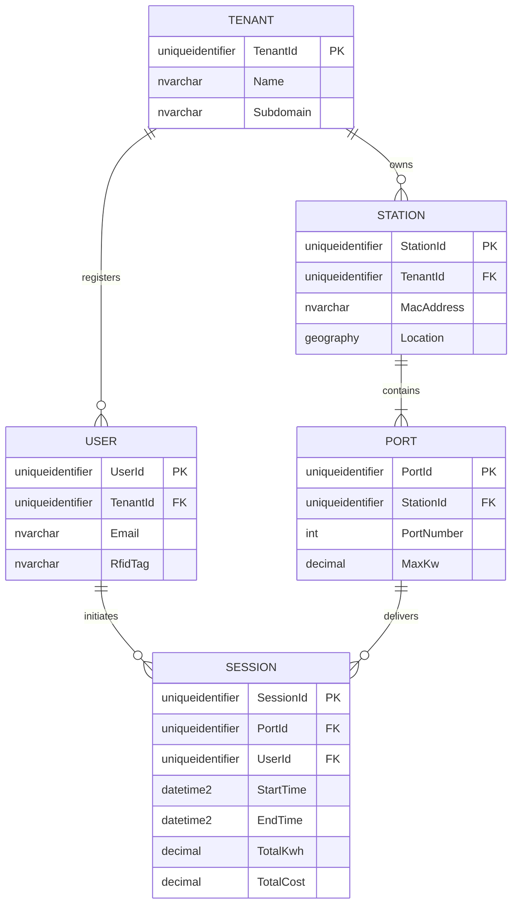

# Chapter 1: Database Fundamentals

## Learning Objectives
By the end of this chapter, you will be able to:
*   Understand the fundamental architecture of Relational Database Management Systems (RDBMS) from a software architect's perspective.
*   Differentiate between on-premises SQL Server and the Platform-as-a-Service (PaaS) offerings in Azure SQL.
*   Deconstruct the domain model for our continuous case study: a high-throughput, Multi-Tenant EV Charging SaaS Platform.
*   Comprehend the physical storage mechanics of SQL Server (Pages, Extents, and the Transaction Log) and why they are critical for optimizing write-heavy IoT workloads.

---

## 1.1 Introduction to the Relational Engine

Modern enterprise SaaS applications are built on data. While NoSQL databases have their place in caching and document storage, the Relational Database Management System (RDBMS) remains the undisputed champion for financial ledgers, billing systems, and complex multi-tenant relationships due to its strict adherence to ACID properties (Atomicity, Consistency, Isolation, Durability) and data integrity constraints.

As a Full Stack Developer transitioning into an Architectural role, your goal is no longer just to "make the query work" via Entity Framework (EF) Core. Your goal is to understand *why* the database behaves the way it does under the load of a thousand concurrent users, and *how* to structure your data so the engine can retrieve it in milliseconds.

### SQL Server vs. Azure SQL
Throughout this book, we will focus primarily on **SQL Server** and its cloud-native sibling, **Azure SQL**. 

*   **SQL Server (On-Premises / IaaS):** You manage the underlying Windows/Linux OS, the disk I/O, the memory allocations, and the backup schedules. You have total control, but also total operational burden.
*   **Azure SQL Database (PaaS):** Microsoft abstracts the OS and hardware. You get automated backups, built-in high availability, and elastic scalability. However, you lose access to server-level features (like SQL Server Agent and Cross-Database queries).

For a modern global SaaS, we default to **Azure SQL** to reduce DevOps overhead, utilizing elastic pools to manage costs across hundreds of tenants.

---

## 1.2 The Domain: Multi-Tenant EV Charging SaaS

To master database engineering, we need a problem complex enough to require advanced architectural patterns. Throughout this book, we will build the database layer for **VoltCore**, a Multi-Tenant Electric Vehicle (EV) Charging Management SaaS.

### The Business Requirements
VoltCore provides a white-labeled dashboard for various organizations (Tenants) to manage their EV charging fleets. 
1.  **Tenants** (e.g., "City of Seattle", "Acme Corp") own physical hardware.
2.  **Stations** are the physical charging pedestals installed in parking lots.
3.  **Ports** (or Connectors) are the actual plugs on a Station. A station might have 2 ports.
4.  **Users** are EV drivers who authenticate via an RFID card or mobile app.
5.  **Sessions** are the continuous telemetry records of a charging event, tracking kilowatt-hours (kWh) delivered, start time, end time, and total cost.

### ER Diagram (Entity-Relationship)



### Multi-Tenant Considerations: The `TenantId`
Notice that almost every root entity has a `TenantId`. This is the hallmark of a **Shared Database, Shared Schema** multi-tenant architecture. Every time a C# API queries this database, it *must* filter by `TenantId` to prevent data leakage between customers. We will explore how to enforce this automatically using EF Core Global Query Filters and SQL Server Row-Level Security (RLS) in later chapters.

---

## 1.3 Internal Architecture: Storage Mechanics

To understand performance, you must understand how SQL Server physically writes data to disk. The EV Charging platform will receive thousands of telemetry pings per second from IoT devices (Stations) reporting charging metrics. If you do not understand the storage engine, your database will buckle under the I/O pressure.

### The Anatomy of a Page
In SQL Server, data is not stored as a continuous stream of text. It is chopped into logical blocks called **Pages**.
*   A Page is exactly **8 Kilobytes (8KB)** in size.
*   This is the fundamental unit of data storage. When SQL Server reads or writes data, it does so at the page level. If you need to update a single 4-byte integer, SQL Server loads the entire 8KB page into memory (RAM), updates it, and writes the 8KB page back to disk.

### The Anatomy of an Extent
An **Extent** is a collection of 8 contiguous pages.
*   8 Pages * 8KB = **64 Kilobytes (64KB)**.
*   Extents are used to efficiently allocate space to tables and indexes.

> **Architect Perspective:** Why does this matter? If a single row in your `SESSION` table is 400 bytes, you can fit roughly 20 rows per 8KB page (accounting for page header overhead). If you perform a query that needs 100,000 sessions, SQL Server must read 5,000 pages from disk. The narrower you make your tables (by choosing optimal data types), the more rows fit on a page, resulting in less disk I/O and exponentially faster queries.

### The Transaction Log (LDF) and Write-Ahead Logging (WAL)
SQL Server relies on two primary file types:
1.  **MDF / NDF (Data Files):** Stores the actual tables and indexes (the 8KB pages).
2.  **LDF (Log Data File):** Stores the transaction log.

When our SaaS inserts a new EV `SESSION`, the data is **not** immediately written to the MDF file on disk. Doing so synchronously for thousands of concurrent IoT devices would cause catastrophic locking and disk thrashing.

Instead, SQL Server uses **Write-Ahead Logging (WAL)**:
1.  The insert is written synchronously to the **Transaction Log (LDF)** sequentially. Sequential writes are blazingly fast.
2.  The data page is updated in Memory (RAM), inside a space called the **Buffer Pool**. The page in RAM is now modified, but the MDF file on disk is outdated. This page is marked as a **"Dirty Page"**.
3.  A background process called the **Checkpoint** periodically wakes up, takes all the "Dirty Pages" from RAM, and flushes them to the MDF file on disk in a highly optimized, asynchronous batch operation.

**Why before How:** We use this architecture because RAM is thousands of times faster than SSDs. By acknowledging the write as soon as it hits the sequential Log file, SQL Server guarantees ACID Durability while providing in-memory speeds for the actual data manipulation.

---

## 1.4 The Code: Setting up EF Core

While we haven't designed the precise data types yet (that is Chapter 2), an Architect must ensure the application layer is configured to interact with the database efficiently. 

In ASP.NET Core, we register the `DbContext`.

```csharp
// Persistence/VoltCoreDbContext.cs
using Microsoft.EntityFrameworkCore;

public class VoltCoreDbContext : DbContext
{
    public DbSet<Tenant> Tenants { get; set; }
    public DbSet<Station> Stations { get; set; }
    public DbSet<Session> Sessions { get; set; }

    public VoltCoreDbContext(DbContextOptions<VoltCoreDbContext> options)
        : base(options)
    {
    }

    protected override void OnModelCreating(ModelBuilder modelBuilder)
    {
        base.OnModelCreating(modelBuilder);
        
        // Architect Note: We explicitly define schemas in enterprise apps
        // to separate concerns (e.g., 'auth', 'billing', 'core').
        modelBuilder.HasDefaultSchema("core");
    }
}
```

```csharp
// Program.cs (.NET 8/9)
builder.Services.AddDbContext<VoltCoreDbContext>(options =>
{
    // Enterprise Best Practice: Enable connection resiliency for Azure SQL
    // Azure SQL occasionally drops connections during load balancing or failovers.
    // EnableRetryOnFailure ensures EF Core automatically retries the transaction.
    options.UseSqlServer(
        builder.Configuration.GetConnectionString("DefaultConnection"),
        sqlOptions => 
        {
            sqlOptions.EnableRetryOnFailure(
                maxRetryCount: 5,
                maxRetryDelay: TimeSpan.FromSeconds(30),
                errorNumbersToAdd: null);
        });
});
```

---

## 1.5 Performance & Security Analysis

### Performance Analysis
*   **The Page Split Penalty:** If you insert data into an 8KB page that is already full, SQL Server must allocate a new page, move half the data to the new page, and update pointers. This is an expensive I/O operation called a "Page Split". We will learn how to avoid this by choosing proper Clustered Index keys (hint: sequential IDs like `UUIDv7` or `IDENTITY`).
*   **Buffer Pool Starvation:** If your queries frequently pull data that is not in RAM (e.g., querying 5 years of historical EV sessions), SQL Server must constantly evict cached pages to load new ones from disk. This destroys performance for the entire system.

### Security Implications
*   **Connection Strings:** Never store connection strings in source control. In Azure, use Azure Key Vault or Managed Identities. A compromised connection string gives attackers full access to the SaaS data.

---

## 1.6 Common Mistakes & Production Pitfalls

1.  **Treating the DB as a Black Box:** Developers often rely entirely on EF Core without understanding the SQL being generated. This works for 10 users, but fails at 10,000.
2.  **Missing Connection Resiliency:** Failing to implement `EnableRetryOnFailure` in cloud environments will result in random `SqlException: A transport-level error has occurred` errors in production, causing failed EV charging sessions.
3.  **Ignoring the Transaction Log Size:** In high-write IoT applications, if backups are not configured correctly (or the DB is in the wrong recovery model), the LDF file will grow until it consumes the entire hard drive, crashing the server.

---

## 1.7 Production Checklist

*   [ ] Database is provisioned in Azure SQL (PaaS) to reduce infrastructure management.
*   [ ] EF Core `DbContext` is configured with `EnableRetryOnFailure()`.
*   [ ] Connection strings are secured using environment variables or Key Vault (no hardcoded secrets).
*   [ ] The team understands that all data read/writes operate in 8KB pages, establishing the mindset for optimizing row sizes.

---

## 1.8 Exercises

1.  **ER Diagram Expansion:** The business has requested a new feature: **Pricing Tariffs**. A Tariff has a time-of-day rate (e.g., $0.15/kWh from 9 AM to 5 PM, $0.10/kWh overnight). A Station belongs to exactly one Tariff. Redraw the ER diagram to include the `TARIFF` entity.
2.  **Storage Calculation:** If a single row in the `USER` table takes exactly 200 bytes, calculate approximately how many users can fit on a single 8KB SQL Server data page (ignore page header overhead for this calculation).

---

## 1.9 Interview Questions

**Q1: Explain the difference between the MDF and LDF files in SQL Server. Why doesn't SQL Server write directly to the MDF file when an INSERT occurs?**
*Answer:* The MDF file stores the actual data pages, while the LDF file stores the transaction log. SQL Server uses Write-Ahead Logging (WAL). Sequential writes to the LDF are much faster than random I/O to the MDF. Data pages are updated in RAM (Buffer Pool) and asynchronously flushed to the MDF later via a Checkpoint. This ensures high write throughput while maintaining ACID durability.

**Q2: If you are building a multi-tenant SaaS application on Azure SQL, why is it critical to configure EF Core with `EnableRetryOnFailure()`?**
*Answer:* Azure SQL is a PaaS environment where the underlying hardware or load balancers might be patched, shifted, or reconfigured dynamically. This can cause brief, transient connection drops (often lasting a few milliseconds). `EnableRetryOnFailure()` instructs EF Core to automatically pause and retry the execution instead of crashing the user's web request, ensuring high availability.

---
**Next up in Chapter 2:** We will dive into SQL Fundamentals and Data Types, specifically analyzing why traditional GUIDs/UUIDs destroy database performance and exploring distributed ID generation strategies for our EV SaaS.
